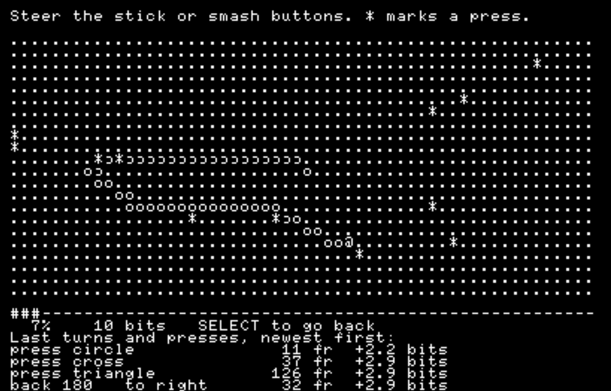

# pspkit-https

**HTTPS for PSP homebrew:** TLS 1.3 on wolfSSL, Mozilla's roots, and a seed
from the player's stick and buttons. Taken out of
[PSPDX](https://github.com/chriopter/pspdx).



```sh
git submodule add https://github.com/chriopter/pspkit-https lib/pspkit-https
docker run --rm -v "$PWD/lib/pspkit-https:/src" -w /src pspdev/pspdev:latest sh tools/build-wolfssl
```

```make
include lib/pspkit-https/module.mk    # before build.mak
```

```c
entropy_set_seed_file("ms0:/PSP/GAME/MYAPP/seed.bin");
entropy_init();
if (!entropy_load()) sweep_ascii_run();   /* first start: the player sweeps */
entropy_save(0);

https_net_connect();
https_get("https://example.org/", sink, ctx, NULL, NULL, &result);
```

- TLS 1.3 only, X25519, ChaCha20-Poly1305 first
- 121 Mozilla roots, pinned, checked weekly
- Dates held against the build day; an expired or unknown certificate asks "connect anyway?"
- A 128-bit seed in about 18 s of stick or buttons, kept in a 32-byte file
- Tested in PPSSPP; [`demo/`](demo/) shows all of it

<details>
<summary><b>TLS</b> · suites, requests, limits</summary>

- Suites: `TLS13-CHACHA20-POLY1305-SHA256`, then `TLS13-AES128-GCM-SHA256`; 5 MB in 1.3 s against 4.8 s (no AES instructions on the PSP)
- `https_net_connect` → Wi-Fi profile 1 → IP, roots parsed on a thread meanwhile (38 ms in PPSSPP)
- `https_get` → DNS → connect → handshake → GET → body into a sink; up to 5 redirects, never down to `http://`
- 3 idle connections kept 30 s; `https_abort()` from any thread stops at the next wait
- Not supported: chunked encoding, POST, IPv6, parallel requests, own roots

</details>

<details>
<summary><b>Certificates</b> · roots, dates, questions</summary>

- `ca/cacert.pem` from curl, pinned by `ca/cacert.pem.sha256`; `ca/update` fetches a new one, `ca/generate` makes `src/ca_bundle.h`
- A workflow runs `ca/update` every Monday and opens a pull request on changes
- Chain and hostname always checked; a bad signature or the wrong host always fails
- Dates: a certificate that expired before the build day is a question, a later expiry passes. The PSP clock resets to 2000; network time can be forged or dropped by the access point, and setting the clock needs a kernel module
- Questions: `https_doubt_take(host)` → EXPIRED or ISSUER → ask → `https_doubt_accept()` → request again; per host, up to 8

</details>

<details>
<summary><b>Seed</b> · sweep, buttons, pool</summary>

- `sweep_step(&s, lx, ly, buttons)` once a frame → `SWEEP_TURN_PAID`, `SWEEP_PRESSED`, `SWEEP_PRESS_PAID`; draw your own screen or call `sweep_ascii_run()`
- A turn pays only if held and not predicted: direction and moment, up to 3 bits each; walls, flicks and circles pay nothing
- A press pays for which button and when, up to 2 bits each; chords, turbo and held buttons nothing; at most 11.25 bits/s
- Simulated honest hands: stick 18.6 s, buttons 17.3 s (median); a random script still passes, it is a heuristic
- SHA-256 pool; wolfSSL gets no seed until it was full once; the file is replaced on every load
- No KIRK chip: kernel module, deterministic generator

</details>

<details>
<summary><b>Threads</b> · who calls what</summary>

- One worker: `https_net_connect`, `https_net_disconnect`, `https_get`, the setters
- Any thread: `https_abort`, `https_close_idle`, `https_get_phase`, `https_get_last_info`
- Entropy owner: `entropy_init`, `entropy_stash`, `entropy_restore`, `entropy_forget`, `sweep_step`
- Each declaration in `include/pspkit-https/` says the rest

</details>

<details>
<summary><b>Development</b> · build, demo, layout</summary>

```text
tools/build-wolfssl   ->  wolfSSL 5.9.2 (submodule) into build/wolfssl
demo/run [--fresh]    ->  build -> PPSSPP -> sweep -> fetch
tests/nettest/run     ->  5 MB over loopback, plain and both suites
tools/entropy-sim     ->  make && ./sim selftest; report.py for the attack report
```

| Location | What |
|---|---|
| `include/pspkit-https/` | `https.h`, `entropy.h`, `sweep.h` |
| `src/` | The library; `ca_bundle.h` is generated |
| `ca/` | The pinned root store and its scripts |
| `wolfssl/` | Submodule, pinned to a release tag |
| `module.mk` | What an app's Makefile includes |

</details>

<details>
<summary><b>Credits</b></summary>

- [wolfSSL](https://github.com/wolfSSL/wolfssl), GPL-2.0; build derived from pspdev's [psp-packages](https://github.com/pspdev/psp-packages)
- Roots: Mozilla, via [curl](https://curl.se/docs/caextract.html)
- GPL-2.0

</details>
